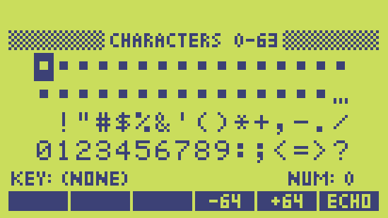
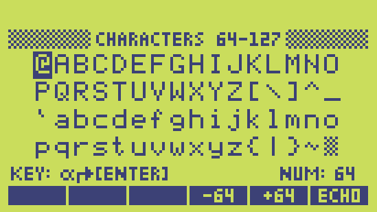
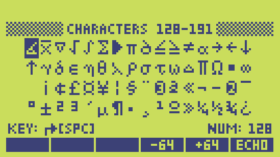

# HP Character set

Welcome to my comprehensive guide on the HP 48 character set, a vital resource for enthusiasts and professionals working with this iconic calculator. The HP 48 series, known for its advanced capabilities and engineering precision, utilizes a unique character set that facilitates effective data input and output, making it indispensable for complex computations and programming tasks.

This webpage offers an in-depth look at the HP 48's character set, presented in a user-friendly table format. Each entry in the table is meticulously detailed with hexadecimal and decimal representations, alongside the corresponding character and its specific role in data communication with the calculator. My aim is to provide you with a thorough understanding of each character's function and usage, enhancing your interaction with the HP 48 series. Whether you're a seasoned programmer or a dedicated collector, this resource is designed to support your projects and enrich your knowledge of this classic computing device.

## Character Codes 0-63: Essential Control and ASCII Characters

This table represents the first 64 characters of the HP 48 calculator's character set, an essential element for anyone involved in programming, mathematics, or data entry using this advanced tool. The characters are listed with their hexadecimal (Hex) and decimal (Dec) codes, as well as their character representation (Chr) and input/output notation (I/O), where applicable. Descriptions provide insights into each character's purpose or symbolism.

The set begins with control characters, like the Null Char (\0) at position 00, and progresses through various control codes represented by caret notation (e.g., ^A for Char A) which have special functions in data handling and calculator control. Following these, we find the ASCII printable characters starting from space ( ) at position 32 (20 in hex), and including symbols, digits, and letters commonly used in mathematical and programming languages. These characters enable the HP 48 to interface with users and external systems effectively, allowing for a wide range of applications from simple calculations to complex programming tasks.

This character set is crucial for understanding the communication and programming paradigms of the HP 48 series, reflecting its design to support scientific computation, data manipulation, and interface customization. Whether you're entering commands, programming, or transferring data, knowing these characters and their codes enhances your efficiency and proficiency with the HP 48.

| Hex | Dec | Chr | I/O  | Description                                |
|:---:|:---:|:---:|:----:|:-------------------------------------------|
| 00  | 00  | \0  |      | Null Char                                  |
| 01  | 01  | ^A  |      | Start of Heading                           |
| 02  | 02  | ^B  |      | Start of Text                              |
| 03  | 03  | ^C  |      | End of Text                                |
| 04  | 04  | ^D  |      | End of Transmission                        |
| 05  | 05  | ^E  |      | Enquiry                                    |
| 06  | 06  | ^F  |      | Acknowledge                                |
| 07  | 07  | ^G  |      | Bell                                       |
| 08  | 08  | ^H  |      | Backspace                                  |
| 09  | 09  | ^I  |      | Horizontal Tab                             |
| 0A  | 10  | ^J  |      | Line Feed                                  |
| 0B  | 11  | ^K  |      | Vertical Tab                               |
| 0C  | 12  | ^L  |      | Form Feed                                  |
| 0D  | 13  | ^M  |      | Carriage Return                            |
| 0E  | 14  | ^N  |      | Shift Out                                  |
| 0F  | 15  | ^O  |      | Shift In                                   |
| 10  | 16  | ^P  |      | Data Link Escape                           |
| 11  | 17  | ^Q  |      | Device Control 1                           |
| 12  | 18  | ^R  |      | Device Control 2                           |
| 13  | 19  | ^S  |      | Device Control 3                           |
| 14  | 20  | ^T  |      | Device Control 4                           |
| 15  | 21  | ^U  |      | Negative Acknowledge                       |
| 16  | 22  | ^V  |      | Synchronous Idle                           |
| 17  | 23  | ^W  |      | End of Trans. Block                        |
| 18  | 24  | ^X  |      | Cancel                                     |
| 19  | 25  | ^Y  |      | End of Medium                              |
| 1A  | 26  | ^Z  |      | Substitute                                 |
| 1B  | 27  | ^[  |      | Escape                                     |
| 1C  | 28  | ^\  |      | File Separator                             |
| 1D  | 29  | ^]  |      | Group Separator                            |
| 1E  | 30  | ^^  |      | Record Separator                           |
| 1F  | 31  | ^_  |      | Unit Separator                             |
| 20  | 32  |     |      | Space                                      |
| 21  | 33  | !   | !    | Exclamation mark                           |
| 22  | 34  | "   | "    | Quotation mark                             |
| 23  | 35  | #   | #    | Dash sign                                  |
| 24  | 36  | $   | $    | Dollar sign                                |
| 25  | 37  | %   | %    | Percent sign                               |
| 26  | 38  | &   | &    | Ampersand                                  |
| 27  | 39  | '   | '    | Apostrophe                                 |
| 28  | 40  | (   | (    | Left parenthesis                           |
| 29  | 41  | )   | )    | Right parenthesis                          |
| 2A  | 42  | *   | *    | Asterisk                                   |
| 2B  | 43  | +   | +    | Plus sign                                  |
| 2C  | 44  | ,   | ,    | Comma                                      |
| 2D  | 45  | -   | -    | Minus sign                                 |
| 2E  | 46  | .   | .    | Full stop                                  |
| 2F  | 47  | /   | /    | Solidus                                    |
| 30  | 48  | 0   | 0    | Digit zero                                 |
| 31  | 49  | 1   | 1    | Digit one                                  |
| 32  | 50  | 2   | 2    | Digit two                                  |
| 33  | 51  | 3   | 3    | Digit three                                |
| 34  | 52  | 4   | 4    | Digit four                                 |
| 35  | 53  | 5   | 5    | Digit five                                 |
| 36  | 54  | 6   | 6    | Digit six                                  |
| 37  | 55  | 7   | 7    | Digit seven                                |
| 38  | 56  | 8   | 8    | Digit eight                                |
| 39  | 57  | 9   | 9    | Digit nine                                 |
| 3A  | 58  | :   | :    | Colon                                      |
| 3B  | 59  | ;   | ;    | Semicolon                                  |
| 3C  | 60  | <   | <    | Less-than sign                             |
| 3D  | 61  | =   | =    | Equals sign                                |
| 3E  | 62  | >   | >    | Greater-than sign                          |
| 3F  | 63  | ?   | ?    | Question mark                              |

## Character Codes 64-127: Extended ASCII Characters

This section of the HP 48 Calculator Character Set page details the characters in the range from 64 to 127. Here, you'll find the extended set of ASCII characters that includes both uppercase and lowercase letters, punctuation marks, and special symbols. This range is pivotal for programming and data input, expanding the versatility of the HP 48 calculator by supporting a broader array of mathematical, scientific, and textual data.

The table presents each character's hexadecimal (Hex) and decimal (Dec) codes, the visual representation (Chr), and where applicable, its input/output notation (I/O). This comprehensive overview is designed to aid users in navigating the HP 48's capabilities for complex operations, programming tasks, and data communication. By understanding these characters and their codes, users can enhance their proficiency with the HP 48, leveraging its full potential in various computational contexts.

| Hex | Dec | Chr | I/O  | Description                                |
|:---:|:---:|:---:|:----:|:-------------------------------------------|
| 40  | 64  | @   | @    | Commercial at                              |
| 41  | 65  | A   | A    | A                                          |
| 42  | 66  | B   | B    | B                                          |
| 43  | 67  | C   | C    | C                                          |
| 44  | 68  | D   | D    | D                                          |
| 45  | 69  | E   | E    | E                                          |
| 46  | 70  | F   | F    | F                                          |
| 47  | 71  | G   | G    | G                                          |
| 48  | 72  | H   | H    | H                                          |
| 49  | 73  | I   | I    | I                                          |
| 4A  | 74  | J   | J    | J                                          |
| 4B  | 75  | K   | K    | K                                          |
| 4C  | 76  | L   | L    | L                                          |
| 4D  | 77  | M   | M    | M                                          |
| 4E  | 78  | N   | N    | N                                          |
| 4F  | 79  | O   | O    | O                                          |
| 50  | 80  | P   | P    | P                                          |
| 51  | 81  | Q   | Q    | Q                                          |
| 52  | 82  | R   | R    | R                                          |
| 53  | 83  | S   | S    | S                                          |
| 54  | 84  | T   | T    | T                                          |
| 55  | 85  | U   | U    | U                                          |
| 56  | 86  | V   | V    | V                                          |
| 57  | 87  | W   | W    | W                                          |
| 58  | 88  | X   | X    | X                                          |
| 59  | 89  | Y   | Y    | Y                                          |
| 5A  | 90  | Z   | Z    | Z                                          |
| 5B  | 91  | [   | [    | Left square bracket                        |
| 5C  | 92  | \\  | \\\\ | Backslash                                  |
| 5D  | 93  | ]   | ]    | Right square bracket                       |
| 5E  | 94  | ^   | ^    | Circumflex accent                          |
| 5F  | 95  | _   | _    | Underscore                                 |
| 60  | 96  | \`   | \`  | Grave accent                               |
| 61  | 97  | a   | a    | a                                          |
| 62  | 98  | b   | b    | b                                          |
| 63  | 99  | c   | c    | c                                          |
| 64  | 100 | d   | d    | d                                          |
| 65  | 101 | e   | e    | e                                          |
| 66  | 102 | f   | f    | f                                          |
| 67  | 103 | g   | g    | g                                          |
| 68  | 104 | h   | h    | h                                          |
| 69  | 105 | i   | i    | i                                          |
| 6A  | 106 | j   | j    | j                                          |
| 6B  | 107 | k   | k    | k                                          |
| 6C  | 108 | l   | l    | l                                          |
| 6D  | 109 | m   | m    | m                                          |
| 6E  | 110 | n   | n    | n                                          |
| 6F  | 111 | o   | o    | o                                          |
| 70  | 112 | p   | p    | p                                          |
| 71  | 113 | q   | q    | q                                          |
| 72  | 114 | r   | r    | r                                          |
| 73  | 115 | s   | s    | s                                          |
| 74  | 116 | t   | t    | t                                          |
| 75  | 117 | u   | u    | u                                          |
| 76  | 118 | v   | v    | v                                          |
| 77  | 119 | w   | w    | w                                          |
| 78  | 120 | x   | x    | x                                          |
| 79  | 121 | y   | y    | y                                          |
| 7A  | 122 | z   | z    | z                                          |
| 7B  | 123 | {   | {    | Left curly bracket                         |
| 7C  | 124 | \|  |  \|  | Vertical line                              |
| 7D  | 125 | }   | }    | Right curly bracket                        |
| 7E  | 126 | ~   | ~    | Tilde                                      |
| 7G  | 127 | ▒   |      | Shade                                      |

## Character Codes 128-191: Special Mathematical and International Symbols

This segment of the HP 48 Calculator Character Set page delves into the characters ranging from 128 to 191, encompassing a variety of special mathematical symbols, Greek letters, arrows, and a selection of international typographic characters. This range enriches the HP 48's ability to handle complex mathematical expressions, scientific equations, and supports a broader linguistic diversity for international use.

Within this table, each entry is clearly outlined with its hexadecimal (Hex) and decimal (Dec) identifiers, the symbolic representation (Chr), and where applicable, the specific input/output notation (I/O). It covers essential mathematical notation such as the integral sign (∫), summation symbol (∑), Greek alphabet characters (α, β, γ, ...), as well as specialized symbols like the infinity sign (∞) and various currency and typographic marks (e.g., ©, ®, £, ¥). This range is critical for users who require precise and varied symbolic representation for advanced computational tasks, programming, and documentation on the HP 48 calculator.

| Hex | Dec | Chr | I/O  | Description                                |
|:---:|:---:|:---:|:----:|:-------------------------------------------|
| 80  | 128 | ∟   | \\<) | Right angle                                |
| 81  | 129 | x̅   | \\x- | x overbar                                  |
| 82  | 130 | ∇   | \\.V | Nabla                                      |
| 83  | 131 | √   | \\v/ | Square root                                |
| 84  | 132 | ∫   | \\.S | Integral                                   |
| 85  | 133 | ∑   | \\GS | Summation                                  |
| 86  | 134 | ▶   | \\\|>| Black right pointing triangle              |
| 87  | 135 | π   | \\pi | pi                                         |
| 88  | 136 | ∂   | \\.d | Partial differential                       |
| 89  | 137 | ≤   | \\<= | Less than or equal to                      |
| 8A  | 138 | ≥   | \\>= | Greater than or equal to                   |
| 8B  | 139 | ≠   | \\=/ | Not equal to                               |
| 8C  | 140 | α   | \\Ga | alpha                                      |
| 8D  | 141 | →   | \\-> | Rightwards arrow                           |
| 8E  | 142 | ←   | \\<- | Leftwards arrow                            |
| 8F  | 143 | ↓   | \\\|v | Downwards arrow                           |
| 90  | 144 | ↑   | \\\|^ | Upwards arrow                             |
| 91  | 145 | γ   | \\Gg | gamma                                      |
| 92  | 146 | δ   | \\Gd | delta                                      |
| 93  | 147 | ε   | \\Ge | epsilon                                    |
| 94  | 148 | η   | \\Gn | eta                                        |
| 95  | 149 | θ   | \\Gh | theta                                      |
| 96  | 150 | λ   | \\Gl | lamda                                      |
| 97  | 151 | ρ   | \\Gr | rho                                        |
| 98  | 152 | σ   | \\Gs | sigma                                      |
| 99  | 153 | τ   | \\Gt | tau                                        |
| 9A  | 154 | ω   | \\Gw | omega                                      |
| 9B  | 155 | Δ   | \\GD | Capital delta                              |
| 9C  | 156 | Π   | \\PI | Capital pi                                 |
| 9D  | 157 | Ω   | \\GW | Capital omega                              |
| 9E  | 158 | ■   | \\[] | Black square                               |
| 9F  | 159 | ∞   | \\oo | Infinity                                   |
| A0  | 160 |     | \\160| No break space                             |
| A1  | 161 | ¡   | \\161| Inverted exclamation mark                  |
| A2  | 162 | ¢   | \\162| Cent sign                                  |
| A3  | 163 | £   | \\163| Pound sign                                 |
| A4  | 164 | ¤   | \\164| Currency sign                              |
| A5  | 165 | ¥   | \\165| Yen sign                                   |
| A6  | 166 | ¦   | \\166| Broken bar                                 |
| A7  | 167 | §   | \\167| Section sign                               |
| A8  | 168 | ¨   | \\168| Diaeresis                                  |
| A9  | 169 | ©   | \\169| Copyright sign                             |
| AA  | 170 | ª   | \\170| Feminine ordinal indicator                 |
| AB  | 171 | «   | \\<< | Left pointing double angle quotation mark  |
| AC  | 172 | ¬   | \\172| Not sign                                   |
| AD  | 173 | ­   | \\173| Soft hyphen                                |
| AE  | 174 | ®   | \\174| Registered sign                            |
| AF  | 175 | ¯   | \\175| Macron                                     |
| B0  | 176 | °   | \\^o | Degree sign                                |
| B1  | 177 | ±   | \\177| Plus minus sign                            |
| B2  | 178 | ²   | \\178| Superscript two                            |
| B3  | 179 | ³   | \\179| Superscript three                          |
| B4  | 180 | ´   | \\180| Acute accent                               |
| B5  | 181 | µ   | \\Gm | Micro sign                                 |
| B6  | 182 | ¶   | \\182| Pilcrow sign                               |
| B7  | 183 | ·   | \\183| Middle dot                                 |
| B8  | 184 | ¸   | \\184| Cedilla                                    |
| B9  | 185 | ¹   | \\185| Superscript one                            |
| BA  | 186 | º   | \\186| Masculine ordinal indicator                |
| BB  | 187 | »   | \\>> | Right pointing double angle quotation mark |
| BC  | 188 | ¼   | \\188| Fraction one quarter                       |
| BD  | 189 | ½   | \\189| Fraction one half                          |
| BE  | 190 | ¾   | \\190| Fraction three quarters                    |
| BF  | 191 | ¿   | \\191| Inverted question mark                     |

## Character Codes 192-255: Extended Latin Characters and Symbols

This final segment of the HP 48 Calculator Character Set page covers the extended range of characters from 192 to 255, showcasing a diverse collection of Latin characters with diacritical marks, as well as the multiplication and division signs. This assortment significantly extends the calculator's utility by accommodating a wide range of linguistic symbols for international languages, alongside important mathematical operations.

In the table, each character is presented with its hexadecimal (Hex) and decimal (Dec) codes, visual representation (Chr), and, when relevant, specific input/output notation (I/O). This range includes characters such as "A with grave" (À), "E with acute" (É), and special symbols like the "Multiplication sign" (×) and "Division sign" (÷), among others. Incorporating these characters allows users to input and display text in multiple languages directly on the HP 48, enhancing its versatility for global use in scientific, educational, and professional settings.

| Hex | Dec | Chr | I/O  | Description                                |
|:---:|:---:|:---:|:----:|:-------------------------------------------|
| C0  | 192 | À   | \\192| A with grave                               |
| C1  | 193 | Á   | \\193| A with acute                               |
| C2  | 194 | Â   | \\194| A with circumflex                          |
| C3  | 195 | Ã   | \\195| A with tilde                               |
| C4  | 196 | Ä   | \\196| A with diaeresis                           |
| C5  | 197 | Å   | \\197| A with ring above                          |
| C6  | 198 | Æ   | \\198| AE                                         |
| C7  | 199 | Ç   | \\199| C with cedilla                             |
| C8  | 200 | È   | \\200| E with grave                               |
| C9  | 201 | É   | \\201| E with acute                               |
| CA  | 202 | Ê   | \\202| E with circumflex                          |
| CB  | 203 | Ë   | \\203| E with diaeresis                           |
| CC  | 204 | Ì   | \\204| I with grave                               |
| CD  | 205 | Í   | \\205| I with acute                               |
| CE  | 206 | Î   | \\206| I with circumflex                          |
| CF  | 207 | Ï   | \\207| I with diaeresis                           |
| D0  | 208 | Ð   | \\208| Eth                                        |
| D1  | 209 | Ñ   | \\209| N with tilde                               |
| D2  | 210 | Ò   | \\210| O with grave                               |
| D3  | 211 | Ó   | \\211| O with acute                               |
| D4  | 212 | Ô   | \\212| O with circumflex                          |
| D5  | 213 | Õ   | \\213| O with tilde                               |
| D6  | 214 | Ö   | \\214| O with diaeresis                           |
| D7  | 215 | ×   | \\215| Multiplication sign                        |
| D8  | 216 | Ø   | \\216| O with stroke                              |
| D9  | 217 | Ù   | \\217| U with grave                               |
| DA  | 218 | Ú   | \\218| U with acute                               |
| DB  | 219 | Û   | \\219| U with circumflex                          |
| DC  | 220 | Ü   | \\220| U with diaeresis                           |
| DD  | 221 | Ý   | \\221| Y with acute                               |
| DE  | 222 | Þ   | \\222| Thorn                                      |
| DF  | 223 | ß   | \\Gb | sharp s                                    |
| E0  | 224 | à   | \\224| a with grave                               |
| E1  | 225 | á   | \\225| a with acute                               |
| E2  | 226 | â   | \\226| a with circumflex                          |
| E3  | 227 | ã   | \\227| a with tilde                               |
| E4  | 228 | ä   | \\228| a with diaeresis                           |
| E5  | 229 | å   | \\229| a with ring above                          |
| E6  | 230 | æ   | \\230| ae                                         |
| E7  | 231 | ç   | \\231| c with cedilla                             |
| E8  | 232 | è   | \\232| e with grave                               |
| E9  | 233 | é   | \\233| e with acute                               |
| EA  | 234 | ê   | \\234| e with circumflex                          |
| EB  | 235 | ë   | \\235| e with diaeresis                           |
| EC  | 236 | ì   | \\236| i with grave                               |
| ED  | 237 | í   | \\237| i with acute                               |
| EE  | 238 | î   | \\238| i with circumflex                          |
| EF  | 239 | ï   | \\239| i with diaeresis                           |
| F0  | 240 | ð   | \\240| eth                                        |
| F1  | 241 | ñ   | \\241| n with tilde                               |
| F2  | 242 | ò   | \\242| o with grave                               |
| F3  | 243 | ó   | \\243| o with acute                               |
| F4  | 244 | ô   | \\244| o with circumflex                          |
| F5  | 245 | õ   | \\245| o with tilde                               |
| F6  | 246 | ö   | \\246| o with diaeresis                           |
| F7  | 247 | ÷   | \\:- | Division sign                              |
| F8  | 248 | ø   | \\248| o with stroke                              |
| F9  | 249 | ù   | \\249| u with grave                               |
| FA  | 250 | ú   | \\250| u with acute                               |
| FB  | 251 | û   | \\251| u with circumflex                          |
| FC  | 252 | ü   | \\252| u with diaeresis                           |
| FD  | 253 | ý   | \\253| y with acute                               |
| FE  | 254 | þ   | \\254| thorn                                      |
| FF  | 255 | ÿ   | \\255| y with diaeresis                           |

